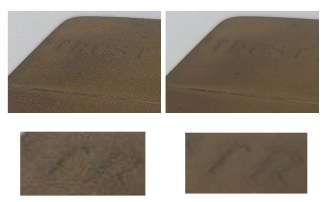

# Averaging

Averaging is a very simple program , built in Python , to average a stack of images.  Averaging , averages similar images, removing the annoying noise (or grain) in photos to obtaining a more smoother result.

An example of this may be observed in the following image.

 

 <b> <i>Fig 1</b>. At the left an image from the stack of images. At the right the average result. </i>

## 1. Brief story of this project

The first time that I read about this kind of techniques was in Digital Image Processing (Gonzalez & Woods) book. I was reading the first part of the book  when  I saw a cell image, with too much noise , the same  image without noise and an a footer note that explained that reconstructed image was the output of some kind of filter. I was astonished.

If I'm not wrong, I read the explanation of the filter and after a few days I decided to implement by myself, but I lost the code  😂  . This happened many years ago.

Some years ago, I told the story of this kind of image processing to a friend sharing this web page <a href="https://petapixel.com/2013/05/29/a-look-at-reducing-noise-in-photographs-using-median-blending/">  A Look at Reducing Noise in Photographs Using Median Blending </a> .  In that case the technique used was median, not exactly averaging, but the main concept is similar. After that chat, he started to ask  about this matter and I always said to him <i>"Ok I'm going to do it </i>" but for one situation or another  I never could implement this again. Some weeks ago he asked to me for this again and well here is...

## 2. Use

#### 2.1  CLI 

##### Dependencies:

This code was tested in Ubuntu 20.04. To run averaging should be install python3-matplotlib

> sudo apt-get install python3-matplotlib

##### Usage: 

> python **Averaging.py**  [SOURCE] [OUTPUT] Source or python **Averaging.py**  --help

##### Source

> **--folder**=<folder> 
> **--files**=<file1.png,file2.png>

###### Output

>**--output**=show Show the output in a window 
> **--output**=<outputfile> Export the result image to outputfile

##### Example

> **Averaging.py** **--folder**=/home/user/photos **--output**=show 

> **Averaging.py** **--files**=/home/user/image1.png,/home/user/image3.png,/home/user/image3.png **--output**=output.png

#### 2.2 GUI

I created a GUI for this tool using PyQt technology.

 

##### Dependencies

> sudo apt-get install python3-matplotlib python3-pyqt5

To execute the GUI in Linux run

> python AveragingQT.py

To execute the GUI in Windows an installer is available in folder **Windows build**

## 3. Average explanation

First of all I know there are tools out there that can achieve this , but implement this code was funny so 🤷

### 3.1 Noise

The main concept that we need to explain  is   after capture an image with a camera, image noise could appear.  This is more obvious and common  on cell phone cameras: If we zoom an image we could see pixels with colors that should not be there. But If we took two different photos of the same object in the same position with the same camera we can note the noise will be different in different places. And if we take the same photo , with the same camera in the same position, the noise , with a high probability, will be different in every image. So in this case we can assume that kind of noise is random.

 

 <b> <i>Fig 2</b>. If we take a photo with digital camera, we can see the presence of noise. If we compare the same group of pixels with another photo taken with the same camera at the same place we could see that noise is different </i>

### 3.2 So, what we can do ?

When the noise is really random, if we capture a lot of images, noise will be different in every image as we said, so in an image a pixel in a specific location could not has noise , and in another image in the same location could has noise, but we cannot check pixel by pixel of  a lot different images and select the correct one to create the correct image, instead of that,  we can apply some algorithm to select the possible right pixel from the stack of photos or try to remove that noise using average operation.

So, average operation in images very simple: every pixel is conformed by 3 or 4 channels (to simplify things we will take as example 3 channels) **R**ed, **G**reen and **B**lue and every channel will take values from 0 to 255 (a byte). If we take, for the sake of simplicity, two images and we obtain the value of a pixel in both images, in the same specific location we will obtain :

 <b> Pixel_at_x_y_Image1=(R1,G1,B1) </b> 

 <b> Pixel_at_x_y_Image2=(R2,G2,B2) </b> 

And to obtain the average simply we need to do

 <b> Average_R_Channel=((R1+R2)/2) </b> 

 <b> Average_G_Channel=((G1+G2)/2) </b> 

 <b> Average_B_Channel=((B1+B2)/2) </b>

Putting all in one equation.

 <b> Average_Pixel_at_x_y=((R1+R2)/2,(G1+G2)/2,(B1+B2)/2) </b>

The following video shows a simple example of this:

 

 <b> <i>Fig 3.</b> A trivial example of pixel averaging </i>

This operation could be extensive to all the pixels of a stack, and averaging pixels we will obtain a smoother image and we will avoid noise. Obviously when larger is the stack better will be the quality of the output. image. Anyway with a few images, some improvement could  be appreciate as we can see in the Fig 4. where the images shown in the Fig 3. were averaged.

 

 <b> <i>Fig 4.</b> Example of resultant image after averaging two images </i>

And if we do this with 20 images we will obtain the result shown in Fig 5.

 

 <b> <i>Fig 5.</b> Example of resultant image after averaging 20 images </i>

### 3.2 Results...

Here I'm going to show a few examples of the averaging result

|  |  |
| :---------------------------------------: | :----------------------------------------------------: |

|  |  |
| -------------------------------------------- | ------------------------------------------- |

 <b> <i>Fig 6.</b> Differents examples of the average result  </i>

Another interesting thing affirmed in the web page <a href="https://petapixel.com/2013/05/29/a-look-at-reducing-noise-in-photographs-using-median-blending/">  A Look at Reducing Noise in Photographs Using Median Blending </a>  as side effect is this: If there are some kind of element that appear in one image but in another image change its position , that element will disappear due to average. An example of this can be appreciate in Fig 7 :  My friend created a stack of 100 images with a Youtube video that showed snow falling , after average the 100 images the snow disappear.

|  |  |
| ------------------------------------------ | ----------------------------------------- |

 <b> <i>Fig 7.</b> At the left an image from the image stack, at the right the resulting image after average 100 images. Notice that snow flakes disappear after average  </i>

## 4. Special thanks

I want to thanks to <a href="https://notoapps.firebaseapp.com/">Federico Noto</a> that provided to me some photos to test and also to  encourage me to make this script ( Do you remember the story at the beginning of this Readme? Well, he was  the friend)

## 5. TODO

- [x] Add a GUI using PyQt
- [x] Add test  for windows
- [x] Add  support for Windows
- [x] Add installer for Windows
- [ ] Add median method

